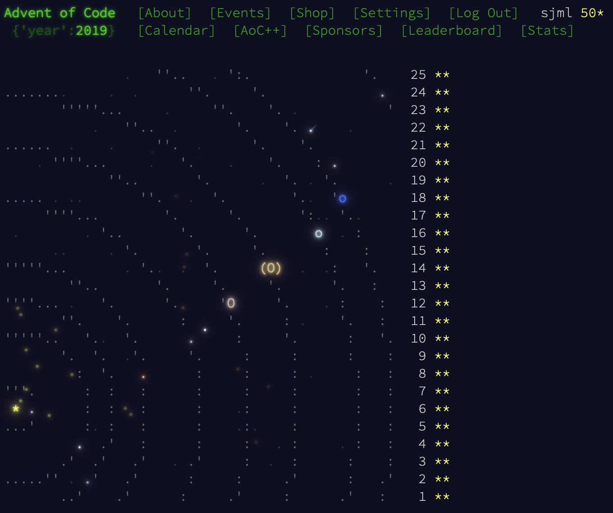

# WasmBots Development History

I am not assuming that WasmBots will be of interest to most people, and its history is probably of interest to even fewer people, but I wanted to record it for me, if nothing else. This also talks through some of the choices of tech. 

## Backstory

The backstory to this whole project is pretty simple: I think [WebAssembly](https://webassembly.org) is a cool technology! I'd played around getting various side projects compiling for it and whenever I make a project in [Godot](https://godotengine.org/), I almost always use the HTML export (which compiles to WebAssembly). But that's just taking an existing program and compiling it for consumption --- I was curious about the other direction, where WebAssembly becomes a kind of universal "plugin" language, allowing platform-agnostic blobs of executable content to just be shuttled around as necessary.

Sadly, most of the energy towards WebAssembly seems to be coming from things I have zero interest in developing and maybe would even prefer they not exist. (Cryptocurrencies and malware.) I would hate for a cool tech to be relegated to the shady corners of the internet and acquire a gross stigma. 

But video games are fun and cool! And in my previous career, I used to make them! Ten years of making games professionally (and however many preceding I made them for fun, and however many preceding _that_ I spent playing them, etc.) have, for better or worse, formed my creative energies such that when I feel the urge to make something, it's usually interactive. 

## Inspirations

### Crobots
 

I had a lingering memory of a program called [Crobots](https://tpoindex.github.io/crobots/) [[Wikipedia Link](https://en.wikipedia.org/wiki/Crobots)] (which, in researching again to write this, I distressingly discovered is pronounced "See Robots" and not "Crow-bots" as I had always imagined), where you could write little AIs in a subset of C and have them fight each other! You can get it running [in the Internet Archive's DOSBox](https://archive.org/details/msdos_shareware_fb_CROBOT) pretty easily: just run `CR-DEMO.BAT` and press enter until things are done compiling. [The old manual is also good reading!](https://tpoindex.github.io/crobots/docs/crobots_manual.html) I was tempted to just do a modern version of this, but I don't like guns. 

### Screeps
<iframe width="560" height="315" src="https://www.youtube-nocookie.com/embed/ZboTgOajnGg?si=gWyeAScNw2z88-LP" title="YouTube video player" frameborder="0" allow="accelerometer; autoplay; clipboard-write; encrypted-media; gyroscope; picture-in-picture; web-share" referrerpolicy="strict-origin-when-cross-origin" allowfullscreen></iframe>

I played around with [Screeps](https://screeps.com/) a few years ago, and it's definitely interesting! While I see **some** people using WebAssembly with it, it's mostly JavaScript or TypeScript authoring. I'm also not interested in making an online connected game --- or, rather, I should say, the details of making such a thing function are a lot less interesting to me than the details of making the local multiplayer work. Setting up servers, handling load, etc. is just not my thing. (Very grateful to those for whom it **is** their thing, though, since I frequently enjoy playing in such spaces!) In any case, I also have a [vow of poverty](https://jesuits.org), and setting up a server that could run such a thing wasn't feasible. 

### Advent of Code

I've been doing [Advent of Code](https://adventofcode.com/) since 2019, and it is one of my favorite things. The story is just the right level of goofy/twee, and the puzzles have made me a substantially better programmer as I've had to go deeper on math and algorithms than I ever did before. Very frequently those puzzles will have you navigating mazes, so writing code to map a space, pathfind, etc. is now close to second-nature. (This is why the map class has an [`aoc()`](https://github.com/sjml/wasmbots/blob/7b1a24efd88f8330d47d16f3d85340f06514ce75/engine/src/game/map.ts#L277) function that outputs in the usual format from Advent of Code. 😝)

## Building the Thing

In early 2022, (when I was living in Lebanon) I spent a few days making [a modified version of Godot](https://github.com/sjml/godot/tree/wasm_engine) that included the [wasmtime](https://wasmtime.dev/) WebAssembly library. I got far enough to run some simple toy programs, but lost interest/motivation. If I was interested in making something a little more polished visually/ludically, I would probably want a proper engine. But there were two factors working against this effort:
* Godot is a big project, and the level of modification I wanted to do would have meant really diving deep and getting to know its systems. Godot is also a really good project that seems to be well-managed, so this would not have been a bad thing, but it was just more food than I wanted to eat at the time. 
* Ultimately, I wanted this to be something that could live on the web... which would have meant compiling wasmtime... into... WebAssembly? That set off some alarm bells. The other option would have been designing it to swap out to the browser's WebAssembly runtime in those builds, but at that point I'd be shuttling back and forth so much I figured why not just build straight for the web. 

In the fall of 2024, I was living in the Philippines. (As of this writing, I still am! Weird that I only get inspired to work on this when I'm outside the US?) The project leapt back into my mind, and I started from the other end, just playing around with the V8 WebAssembly runtime via [Deno](https://deno.com/). This led to a set of experiments that got rolled into a [little proof of concept](https://github.com/sjml/wasmbots_proof-of-concept) showing multiple programming languages compiling modules that a central host could run without caring about how they were implemented. This proof of concept is nothing innovative, but it was educational for **me** learning how these things worked. Just simple stuff like how to share memory between modules and the host makes sense once you know it, but the documentation can be a little confusing. Once I had that working, though, I was off and running. 

## Module Specs

If I wanted a language-agnostic plugin system, that meant needing to formalize what functions the host would expect to call in the module and vice versa. I took a guess at [an API design](https://github.com/sjml/wasmbots/blob/7b1a24efd88f8330d47d16f3d85340f06514ce75/engine/src/data/guestAPI.json) that has stayed remarkably stable. Any program that will run in WasmBots needs to adhere to this spec if it wants to get anything done. But could I verify its adherence before I started running it? Turns out, not too easily! Once the module is available to the browser's runtime, the function signatures are all stuffed into JavaScript form, which means you lose the beautiful specificity of types and everything becomes `number`. 😓 

It seems the best tool for interrogating a compiled module is called, plainly enough, [wasmparser](https://docs.rs/wasmparser), and is part of the aforementioned [wasmtime](https://wasmtime.dev/). The problem is that wasmtime is written in Rust, and is not meant to be part of a web toolkit. But wait... the whole point of this project is to muck around with WebAssembly, so could I compile wasmparser _itself_ to WebAssembly and then invoke it on the uploaded binary? [Yes, yes I could. ](https://github.com/sjml/wasmbots/tree/main/validator) A little heavy-handed (the validator module is, at present, an order of magnitude larger than any of the modules I've tested with it) and **more** than a little silly, but good to have formal validation! 

The API only describes a minimal set of functions between host and module, though --- this was very much by design because I knew the bulk of actual salient communication would be an ever-evolving format, and didn't want to lock in the API. So the host basically says "look at this spot in memory to find your current situation" and the module replies "thanks, look at this place in memory for my response." Then the question became how to format that information flow.

## Communications

The first thought was to just pass JSON messages around, but that presumes a JSON toolkit on the module side, and parsing JSON in most non-scripting languages is decidedly not fun. I didn't want this to be an exercise in parsing. So the earliest versions just wrote raw values directly into memory and trusted the host and module to know where to read/write. That worked fine for the toy versions where I was just telling the modules to calculate a specific Fibonacci number, but once any more complicated data was going to be shared, I knew I would want a better way of structuring it. 

By strange coincidence, I had written just such a tool a couple years prior for another project! [Beschi](https://github.com/sjml/beschi) is a code generator that takes a message format description and writes code for reading and writing that message to and from memory buffers across multiple languages. With the previous project that Beschi spun out of, I had looked at things like [Cap'nProto](https://capnproto.org/) and [FlatBuffers](https://flatbuffers.dev/), but didn't love the developer experience of either of them. They also provided a level of flexibility I didn't need, and I wanted simpler generated code. So I wrote a quick Python tool to do so that eventually became its own project. (Can you tell I enjoy [yak-shaving](https://softwareengineering.stackexchange.com/questions/388092/what-exactly-is-yak-shaving)?) 

(Could I have instead simply written something that unpacks the JSON for the different target languages of WasmBots? Maybe! But Beschi was just sitting there.)

Despite it being my own project, I am not wed to using Beschi for this, and may swap it out at some point. It's proven to work pretty well so far, but also has not been pushed to the limit. Beschi's simplicity has already proven a boon, though, as I was able to add generators for both Zig and AssemblyScript in very little time, where if I was using other systems I would be stuck with whatever languages had implementations. Beschi's written buffer format is also (almost absurdly) straightforward so if someone doesn't like using Beschi for whatever reason, they can write their own parsing code from [the message format](https://github.com/sjml/wasmbots/blob/7b1a24efd88f8330d47d16f3d85340f06514ce75/engine/src/data/messaging.toml) without too much trouble. (The engine will continue to use Beschi internally for writing those messages and reading from the client... at least until it doesn't.)

## Module Languages

There are five languages that I think of as "first class" for this. Anything valid WebAssembly that meets the spec will work, but these have their [libraries](./libraries.md) and [trainers](./trainers.md) to make development of modules easier. 

In no particular order: 

* C --- the old reliable. Compiles easily with [Emscripten](https://emscripten.org/). 
* Rust --- the encroaching behemoth. Has very good built-in WebAssembly support. 
* Zig --- the scrappy upstart. Good built-in WebAssembly support, much nimbler language with smaller executables. 
* AssemblyScript --- a strange in-between language that feels (to me) weird to write in. Super popular because WebAssembly is kind of its whole _raison d'être_, though.
* Go --- an odd fit for this space, but works well! At least when compiled with [TinyGo](https://tinygo.org/). 

The note on Go is instructive: SO many things that compile to WebAssembly make a lot of assumptions about what the host does. The standard Go compiler and [wasm-bindgen](https://github.com/rustwasm/wasm-bindgen) both generate a hefty JavaScript package that they expect you to integrate on your frontend. This is a totally reasonable thing if you're writing a WebAssembly module meant to be hosted on one specific site and are building both together. But for WasmBots, I want the modules to **only** be WebAssembly, not assuming anything other than the API. So that meant finding things like TinyGo, which was neat! 

Less neat is the utter dearth of anyone writing WebAssembly in Rust without wasm-bindgen. I'm sure it's a great library, but it's not right for this context, and I worry a little that the ecosystem is getting a little too dependent on it. But that's not my problem! Maybe if things like WasmBots become more popular then more people will know how to build things without a JS runtime on the other side.

## UI and Visualization

For the basic web UI stuff, I use [Svelte](https://svelte.dev/). I've never bothered to learn React, which I know is everyone's favorite, but Svelte fits my brain well. Never considered another toolkit. Right after I started, though, [Svelte 5 released](https://svelte.dev/blog/svelte-5-is-alive), which I decided to jump on because this was an early-stage project. That entailed some un-learning and learning, but on the whole I've been very happy with how easily Svelte lets me build stuff. 

Then there was the question of game engine. Because I was trying to keep the non-WebAssembly parts of this strictly JavaScript (or TypeScript or what-have-you), that meant looking to web-native engines instead of something like Godot. This is not a space I knew very well, but research seemed to keep pointing back to [Phaser](https://phaser.io/), which I eventually settled on. Phaser is definitely one of the most popular web game frameworks, and it hits a nice sweet spot of functionality and relatively lightness. Its documentation is very much not great, though (and they recently moved everything to a new domain without properly redirecting old stuff, so even helpful articles and web searches have been made useless). I'm not pushing it too hard, but even just trying to do this simple stuff has been a little frustrating. The problem is almost certainly me, not Phaser, as lots of other people seem to be using it without problem. This may be a situation where I've gotten spoiled by using different tools meant for a different domain. (I also used to manage [my own 2D engine](https://github.com/angel2d/angel2d), so could just be over-opinionated.)

## The Game!

Like I said, I have a visceral dislike of guns, but old school sword-and-sorcery fights don't hit that same panic button in my brain, so I was probably going to build something vaguely in the realm of your standard fantasy game trope. Combine the affection for navigation of procedural mazes from Advent of Code and way too many hours spent playing various text-interface games, I ended imagining something along the lines of a very **very** basic roguelike. 

One of the big differences, though, is that the system does not handle mapping for you. Every turn the bot receives information about its immediate surroundings and what happened during the last turn. From there, it's up to the player code to track the state of the world, their position, etc. 

While I had spent plenty of time _playing_ roguelikes, I'd never tried to build one before, so did a lot of reading on [RogueBasin](https://www.roguebasin.com/). Thankfully the game in my head is a fairly simple one, but things like [line-of-sight](https://www.roguebasin.com/index.php?title=FOV_using_recursive_shadowcasting) are still way more complicated than I had anticipated! In retrospect, I might have benefitted from integrating [rot.js](https://ondras.github.io/rot.js/) or something similar on the backend, but at each step it seemed easier to just build it myself than revamp everything to run through another library. Plus it meant I got to learn more things! 

The vision (as yet incomplete) is that the players navigate the space collecting power-ups (weapons, spells, potions) and engaging or avoiding conflict with other players as per their strategies. Goals are pretty flexible: find the MacGuffin, last person standing, capture the flag, etc. That part is a little hazy, to be honest, but if my past gamedev experience is any indicator, it will come into focus as I build it out. 

In the future there might be monsters, NPCs, traps, multiple floors, teleporters, etc. (The latter two will make pathfinding more fun!) But we'll see how long my motivation lasts. (And/or if anyone else comes along that is interested in working on this.)

## Maps 

What good is a bot if they have nothing to explore? I made a few static maps while developing the systems for line-of-sight and navigation, but knew ultimately I'd want something procedural. I had known Bob Nystrom from his **excellent** [_Crafting Interpreters_](https://craftinginterpreters.com/) book, and was delighted to find that about ten years ago he turned his technical writing skill to explaining [a dungeon generation algorithm](https://journal.stuffwithstuff.com/2014/12/21/rooms-and-mazes/). The current dungeon generator in the game is a slightly modified version of this algorithm, implemented in TypeScript instead of Dart, and with the ability to add specific rooms so I can create known spawn points in the corners. 

The algorithm just generates walls and doors, though, so I needed some way of visualizing it. (Well, the bots don't strictly need it, but it's WAY more fun to see things move around than to simply watch `{x, y}` values change in a memory watch window.) Phaser has good support for the [Tiled](https://www.mapeditor.org/) editor, and outputting my generated maps to that JSON format was pretty easy. The real "fun" came in trying to paint them so they looked more fun than simple "black == wall; white == floor; gray == door" programmer art. I reached way back into my undergrad graphics course to remember [Wang Tiles](https://en.wikipedia.org/wiki/Wang_tile), and built [a shaky and brittle implementation](https://github.com/sjml/wasmbots/blob/81a90e99e79938525cfdedbe9ce451ad3a60bf2e/engine/src/generation/painter.ts) of them with a lot of help from [Boris the Brave's archive of Guy Walker's Stagecast](http://www.boristhebrave.com/permanent/24/06/cr31/stagecast/wang/blob.html). I would love to push more information into the tileset so this could be more data-driven, but waiting on [Tiled's overhaul of metadata](https://github.com/mapeditor/tiled/pull/4045) to land before committing to that. 

## Art

[My skills as an artist are very _**very**_ limited.](https://twitter.com/OptimistPanda/status/268375222560899074) So all the imagery in the game comes via assets from [Kenney](https://kenney.nl/assets/tiny-dungeon) and [Pixel_Poem](https://pixel-poem.itch.io/dungeon-assetpuck). Would love to make custom stuff at some point, but the point of this was not to wow people with the graphics. 

(That said, if YOU are an artist who feels inspired to help with this, please get in touch!)
