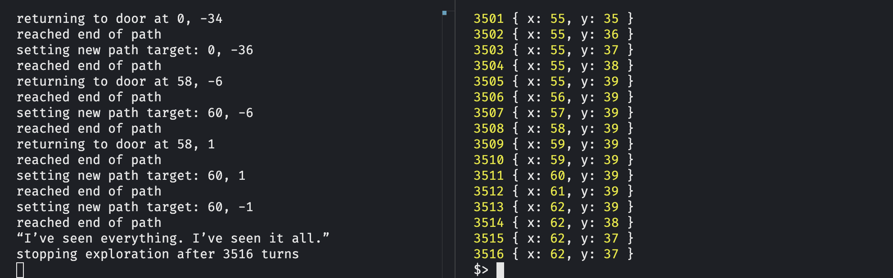

# Trainers

Alongside each of [the client libraries](./libraries.md), each target language (except AssemblyScript) includes a "trainer" program. Since debugging WebAssembly is very difficult, you can, instead, build your bot code into a native executable for testing. This native program runs a web server on port 9090 that [a special TypeScript wrapper](../engine/src/deno-cli/trainer.ts) can communicate with. You start up the trainer program and then run that script. At the moment, all it will do is drop your bot into a random map and then call its tick function repeatedly. All time limits are turned off in this mode; you can set breakpoints, debug memory, etc. all the things you're used to doing to fix your code when it's running natively. (This is assuming you know how to do such things in your IDE or tools of choice --- consult your programming language's documentation if you don't.)

## Example Usage
As an example, to use the trainer for the [example bot written in Zig](../example_bots_src/explorer/). Note that you need to have [Deno](https://deno.com) installed.

In one terminal:
1. `cd example_bots_src/explorer`
2. `make trainer`
3. Run the trainer:
   * Either directly with `./zig-out/bin/explorer-trainer`
   * Or via a debugger in your IDE/editor. 

In another terminal:
1. `cd engine/src/deno-cli`
2. `deno run --allow-net --allow-read --allow-run trainer.ts`

The latter will interface with the trainer server and cause it to run the module setup functions, create a random dungeon, and then tick the module repeatedly. Whatever you need to do on your end to debug, you can do. Note that the TypeScript trainer script is very straightforward, so you could easily edit it to do something different if needed. 

(I admit it is probably more than a little confusing to refer to both programs as "trainer.")

_Note in the above screenshot that the TypeScript trainer (on the right) ticked the module 3516 times, outputting its true location at each step. The Zig server, on the left, prints all the module's logs, which include locations relative to its origin (since the module does not know its true location in the game world.) Once the module resigns the game upon completing its exploration, the TypeScript trainer exits._

## Caveats about the trainers
* They are not general-purpose web servers; they're just using HTTP as a convenient communication channel. They aren't secured or robustified or even multi-threaded. They don't have clever routing, so if you try to access an endpoint they don't have, they might crash, might return nothing. Most don't enforce methods (but they want `POST`).
* They are pretty simple, using each language's built-in net functionality as much as possible. Memory is shared by passing it as base64-encoded strings in JSON because that's easier than multi-part forms. 
* They don't recover from panics or crashes at all --- the thought is that if your program crashes the memory is probably in an unusable state anyway. I could have figured out a 5-language consistent way of ejecting and reloading or something... or you could just restart it when something goes wrong. Simplicity! 
* Where the client libraries strictly have no dependencies, the trainers likely have a few. They don't end up in your final WebAssembly, so it's cool. 

Note that the trainer program is running native on your machine instead of within a WebAssembly context; in the cases of C and Go it was built by an entirely separate compiler. They are all set up to have full debug information available, since that's the whole point. BUT, all these caveats mean that if you're running into some low-level issue (the kind of thing that shows up in the differences between debug and release builds), or there's some compiler-specific behavior you're investigating, this won't really help you. It's great for debugging the actual behavioral logic of your bot, though! 

In the future I'd like to make some graphical tools (or at least some default VS Code launch configurations) to make this a little more useful, but it's already been a pretty big help for me as I built [the example bots](../example_bots_src/). 

There's no trainer for AssemblyScript because the language itself has no native mode. Alack.
